# Monkeys IAM Database Schema Documentation

This document provides comprehensive documentation for the Monkeys Identity & Access Management (IAM) database schema, including detailed explanations of all tables, fields, relationships, and usage examples.

## 📊 Database Overview

The Monkeys IAM database is built on PostgreSQL and implements a comprehensive identity and access management system with the following key features:

- **Multi-tenant architecture** with organization-based isolation
- **Policy-based access control** with JSON policy documents
- **Role-based access control (RBAC)** with hierarchical roles
- **Comprehensive audit trails** for compliance and security
- **Session management** with device tracking and MFA support
- **Resource management** with ARN-style naming conventions

## 🗂️ Database Structure

### Core Entity Types

```sql
-- Custom enumeration types for type safety
CREATE TYPE entity_status AS ENUM ('active', 'suspended', 'deleted', 'archived');
CREATE TYPE principal_type AS ENUM ('user', 'service_account', 'group');
CREATE TYPE resource_type AS ENUM ('object', 'service', 'namespace', 'infrastructure');
CREATE TYPE policy_effect AS ENUM ('allow', 'deny');
CREATE TYPE audit_result AS ENUM ('success', 'failure', 'error');
CREATE TYPE session_status AS ENUM ('active', 'expired', 'revoked');
CREATE TYPE mfa_method AS ENUM ('totp', 'sms', 'email', 'hardware', 'biometric');
```

## 📋 Core Entity Tables

### 1. Organizations Table

**Purpose**: Top-level tenant entities that provide isolation boundaries for multi-tenant deployments.

```sql
CREATE TABLE organizations (
    id UUID PRIMARY KEY DEFAULT uuid_generate_v4(),
    name VARCHAR(255) NOT NULL,
    slug VARCHAR(100) NOT NULL UNIQUE,
    parent_id UUID REFERENCES organizations(id),
    description TEXT,
    metadata JSONB NOT NULL DEFAULT '{}',
    settings JSONB NOT NULL DEFAULT '{}',
    billing_tier VARCHAR(50) DEFAULT 'standard',
    max_users INTEGER DEFAULT 1000,
    max_resources INTEGER DEFAULT 10000,
    status entity_status NOT NULL DEFAULT 'active',
    created_at TIMESTAMP WITH TIME ZONE NOT NULL DEFAULT NOW(),
    updated_at TIMESTAMP WITH TIME ZONE NOT NULL DEFAULT NOW(),
    deleted_at TIMESTAMP WITH TIME ZONE
);
```

#### Field Descriptions

| Field | Type | Description | Example |
|-------|------|-------------|---------|
| `id` | UUID | Unique identifier for the organization | `123e4567-e89b-12d3-a456-426614174000` |
| `name` | VARCHAR(255) | Human-readable organization name | `"Acme Corporation"` |
| `slug` | VARCHAR(100) | URL-friendly identifier (unique) | `"acme-corp"` |
| `parent_id` | UUID | Reference to parent organization for hierarchies | `456e7890-e89b-12d3-a456-426614174000` |
| `description` | TEXT | Optional organization description | `"Leading technology company"` |
| `metadata` | JSONB | Extensible organization properties | `{"industry": "technology", "founded": 2020}` |
| `settings` | JSONB | Organization-level configurations | `{"sso_enabled": true, "mfa_required": false}` |
| `billing_tier` | VARCHAR(50) | Subscription/billing level | `"enterprise"`, `"professional"`, `"standard"` |
| `max_users` | INTEGER | Maximum allowed users | `1000` |
| `max_resources` | INTEGER | Maximum allowed resources | `10000` |

#### Example Usage

```sql
-- Create a parent organization
INSERT INTO organizations (name, slug, description, billing_tier) 
VALUES ('Acme Corporation', 'acme-corp', 'Leading technology company', 'enterprise');

-- Create a subsidiary organization
INSERT INTO organizations (name, slug, parent_id, description) 
VALUES ('Acme Labs', 'acme-labs', (SELECT id FROM organizations WHERE slug = 'acme-corp'), 'R&D Division');
```

### 2. Users Table

**Purpose**: Human identities within the system with authentication and profile information.

```sql
CREATE TABLE users (
    id UUID PRIMARY KEY DEFAULT uuid_generate_v4(),
    username VARCHAR(100) NOT NULL,
    email VARCHAR(255) NOT NULL,
    email_verified BOOLEAN NOT NULL DEFAULT FALSE,
    display_name VARCHAR(255),
    avatar_url TEXT,
    organization_id UUID NOT NULL REFERENCES organizations(id),
    password_hash VARCHAR(255),
    password_changed_at TIMESTAMP WITH TIME ZONE DEFAULT NOW(),
    mfa_enabled BOOLEAN NOT NULL DEFAULT FALSE,
    mfa_methods JSONB NOT NULL DEFAULT '[]',
    mfa_backup_codes TEXT[],
    attributes JSONB NOT NULL DEFAULT '{}',
    preferences JSONB NOT NULL DEFAULT '{}',
    last_login TIMESTAMP WITH TIME ZONE,
    failed_login_attempts INTEGER NOT NULL DEFAULT 0,
    locked_until TIMESTAMP WITH TIME ZONE,
    status entity_status NOT NULL DEFAULT 'active'
);
```

#### Field Descriptions

| Field | Type | Description | Example |
|-------|------|-------------|---------|
| `username` | VARCHAR(100) | Unique username within organization | `"john.doe"` |
| `email` | VARCHAR(255) | Primary email address | `"john.doe@acme.com"` |
| `email_verified` | BOOLEAN | Whether email has been verified | `true` |
| `display_name` | VARCHAR(255) | Full display name | `"John Doe"` |
| `avatar_url` | TEXT | Profile picture URL | `"https://cdn.acme.com/avatars/john.jpg"` |
| `password_hash` | VARCHAR(255) | Bcrypt hash of password | `"$2a$10$N9qo8uLOickgx2ZMRZoMyeIjZAgcfl7p92ldGxad68LJZdL17lhWy"` |
| `mfa_enabled` | BOOLEAN | Multi-factor authentication status | `true` |
| `mfa_methods` | JSONB | Array of enabled MFA methods | `["totp", "sms"]` |
| `mfa_backup_codes` | TEXT[] | Encrypted backup codes | `["{encrypted_code_1}", "{encrypted_code_2}"]` |
| `attributes` | JSONB | Custom user attributes | `{"department": "Engineering", "employee_id": "E001"}` |
| `preferences` | JSONB | User preferences | `{"theme": "dark", "language": "en"}` |
| `failed_login_attempts` | INTEGER | Count of consecutive failed logins | `0` |
| `locked_until` | TIMESTAMP | Account lock expiration time | `2024-01-15 10:30:00+00` |

#### Example Usage

```sql
-- Create a new user
INSERT INTO users (username, email, display_name, organization_id, attributes) 
VALUES (
    'john.doe', 
    'john.doe@acme.com', 
    'John Doe',
    (SELECT id FROM organizations WHERE slug = 'acme-corp'),
    '{"department": "Engineering", "manager": "jane.smith", "hire_date": "2024-01-15"}'
);

-- Enable MFA for a user
UPDATE users 
SET mfa_enabled = true, mfa_methods = '["totp", "backup_codes"]'
WHERE email = 'john.doe@acme.com';
```

### 3. Service Accounts Table

**Purpose**: Machine identities for applications, services, and automated systems.

```sql
CREATE TABLE service_accounts (
    id UUID PRIMARY KEY DEFAULT uuid_generate_v4(),
    name VARCHAR(255) NOT NULL,
    description TEXT,
    organization_id UUID NOT NULL REFERENCES organizations(id),
    key_rotation_policy JSONB NOT NULL DEFAULT '{"enabled": true, "rotation_days": 90}',
    allowed_ip_ranges INET[],
    max_token_lifetime INTERVAL DEFAULT '24 hours',
    last_key_rotation TIMESTAMP WITH TIME ZONE DEFAULT NOW(),
    attributes JSONB NOT NULL DEFAULT '{}',
    status entity_status NOT NULL DEFAULT 'active'
);
```

#### Field Descriptions

| Field | Type | Description | Example |
|-------|------|-------------|---------|
| `name` | VARCHAR(255) | Service account name | `"api-gateway-service"` |
| `description` | TEXT | Purpose description | `"Service account for API Gateway authentication"` |
| `key_rotation_policy` | JSONB | Automatic key rotation settings | `{"enabled": true, "rotation_days": 30, "notify_before": 7}` |
| `allowed_ip_ranges` | INET[] | Network access restrictions | `["10.0.0.0/8", "192.168.1.0/24"]` |
| `max_token_lifetime` | INTERVAL | Maximum session duration | `24 hours` |
| `last_key_rotation` | TIMESTAMP | Last key rotation time | `2024-01-01 00:00:00+00` |
| `attributes` | JSONB | Custom service account properties | `{"service_type": "microservice", "environment": "production", "owner_team": "backend", "cost_center": "ENG001"}` |
| `status` | entity_status | Service account status | `"active"`, `"suspended"`, `"deleted"`, `"archived"` |

#### Example Usage

```sql
-- Create a service account for microservice
INSERT INTO service_accounts (name, description, organization_id, allowed_ip_ranges, attributes)
VALUES (
    'payment-service',
    'Service account for payment processing microservice',
    (SELECT id FROM organizations WHERE slug = 'acme-corp'),
    ARRAY['10.0.1.0/24'::INET],
    '{"service_type": "microservice", "environment": "production"}'
);
```

### 4. Groups Table

**Purpose**: Collections of users and service accounts for simplified permission management.

```sql
CREATE TABLE groups (
    id UUID PRIMARY KEY DEFAULT uuid_generate_v4(),
    name VARCHAR(255) NOT NULL,
    description TEXT,
    organization_id UUID NOT NULL REFERENCES organizations(id),
    parent_group_id UUID REFERENCES groups(id),
    group_type VARCHAR(50) DEFAULT 'standard',
    attributes JSONB NOT NULL DEFAULT '{}',
    max_members INTEGER DEFAULT 1000,
    status entity_status NOT NULL DEFAULT 'active'
);
```

#### Field Descriptions

| Field | Type | Description | Example |
|-------|------|-------------|---------|
| `id` | UUID | Unique identifier for the group | `123e4567-e89b-12d3-a456-426614174000` |
| `name` | VARCHAR(255) | Group name | `"Engineering Team"` |
| `description` | TEXT | Optional group description | `"All engineering team members and contractors"` |
| `organization_id` | UUID | Reference to owning organization | Reference to organization ID |
| `parent_group_id` | UUID | Parent group for hierarchies | Reference to "All Employees" group |
| `group_type` | VARCHAR(50) | Group category | `"department"`, `"project"`, `"role"`, `"team"` |
| `attributes` | JSONB | Custom group properties | `{"cost_center": "ENG001", "manager": "jane.smith@acme.com", "budget": 500000}` |
| `max_members` | INTEGER | Maximum group size | `50` |
| `status` | entity_status | Group status | `"active"`, `"suspended"`, `"deleted"`, `"archived"` |

#### Example Usage

```sql
-- Create a department group
INSERT INTO groups (name, description, organization_id, group_type, attributes)
VALUES (
    'Engineering',
    'All engineering team members',
    (SELECT id FROM organizations WHERE slug = 'acme-corp'),
    'department',
    '{"cost_center": "ENG001", "manager": "jane.smith@acme.com"}'
);

-- Create a project subgroup
INSERT INTO groups (name, description, organization_id, parent_group_id, group_type)
VALUES (
    'Project Alpha',
    'Members working on Project Alpha',
    (SELECT id FROM organizations WHERE slug = 'acme-corp'),
    (SELECT id FROM groups WHERE name = 'Engineering'),
    'project'
);
```

### 5. Group Memberships Table

**Purpose**: Many-to-many relationships between principals (users/service accounts) and groups.

```sql
CREATE TABLE group_memberships (
    id UUID PRIMARY KEY DEFAULT uuid_generate_v4(),
    group_id UUID NOT NULL REFERENCES groups(id),
    principal_id UUID NOT NULL,
    principal_type principal_type NOT NULL,
    role_in_group VARCHAR(50) DEFAULT 'member',
    joined_at TIMESTAMP WITH TIME ZONE NOT NULL DEFAULT NOW(),
    expires_at TIMESTAMP WITH TIME ZONE,
    added_by UUID
);
```

#### Field Descriptions

| Field | Type | Description | Example |
|-------|------|-------------|---------|
| `id` | UUID | Unique identifier for the membership | `123e4567-e89b-12d3-a456-426614174000` |
| `group_id` | UUID | Reference to the group | Reference to "Engineering" group ID |
| `principal_id` | UUID | ID of user or service account | Reference to user or service account ID |
| `principal_type` | principal_type | Type of principal being added | `"user"`, `"service_account"` |
| `role_in_group` | VARCHAR(50) | Role within the group | `"member"`, `"admin"`, `"owner"`, `"moderator"` |
| `joined_at` | TIMESTAMP | When the membership was created | `2024-01-15 10:30:00+00` |
| `expires_at` | TIMESTAMP | Optional membership expiration | `2024-12-31 23:59:59+00` |
| `added_by` | UUID | Who added this member | Reference to admin user ID |

#### Example Usage

```sql
-- Add user to group
INSERT INTO group_memberships (group_id, principal_id, principal_type, role_in_group)
VALUES (
    (SELECT id FROM groups WHERE name = 'Engineering'),
    (SELECT id FROM users WHERE email = 'john.doe@acme.com'),
    'user',
    'member'
);

-- Add user as group admin with expiration
INSERT INTO group_memberships (group_id, principal_id, principal_type, role_in_group, expires_at)
VALUES (
    (SELECT id FROM groups WHERE name = 'Project Alpha'),
    (SELECT id FROM users WHERE email = 'jane.smith@acme.com'),
    'user',
    'admin',
    '2024-12-31 23:59:59+00'
);
```

### 6. Resources Table

**Purpose**: Unified representation of any accessible object, service, or infrastructure component.

```sql
CREATE TABLE resources (
    id UUID PRIMARY KEY DEFAULT uuid_generate_v4(),
    arn TEXT NOT NULL UNIQUE,
    name VARCHAR(255) NOT NULL,
    description TEXT,
    type resource_type NOT NULL,
    organization_id UUID NOT NULL REFERENCES organizations(id),
    parent_resource_id UUID REFERENCES resources(id),
    owner_id UUID,
    owner_type principal_type,
    attributes JSONB NOT NULL DEFAULT '{}',
    tags JSONB NOT NULL DEFAULT '{}',
    encryption_key_id UUID,
    lifecycle_policy JSONB NOT NULL DEFAULT '{}',
    access_level VARCHAR(50) DEFAULT 'private',
    content_type VARCHAR(100),
    size_bytes BIGINT DEFAULT 0,
    checksum VARCHAR(64),
    version VARCHAR(50) DEFAULT '1.0',
    status entity_status NOT NULL DEFAULT 'active'
);
```

#### Field Descriptions

| Field | Type | Description | Example |
|-------|------|-------------|---------|
| `arn` | TEXT | Amazon Resource Name style identifier | `"arn:monkey:storage:us-east-1:acme-corp:bucket/documents"` |
| `type` | resource_type | Resource category | `"object"`, `"service"`, `"namespace"`, `"infrastructure"` |
| `parent_resource_id` | UUID | Parent resource for hierarchies | Reference to parent folder/service |
| `owner_id` | UUID | Resource owner (user/service account) | User or service account ID |
| `owner_type` | principal_type | Type of owner | `"user"`, `"service_account"` |
| `tags` | JSONB | Key-value tags for categorization | `{"environment": "prod", "team": "backend"}` |
| `encryption_key_id` | UUID | Encryption key reference | `"key-123e4567-e89b-12d3"` |
| `lifecycle_policy` | JSONB | Retention and archival rules | `{"retention_days": 365, "auto_archive": true}` |
| `access_level` | VARCHAR(50) | Access scope | `"private"`, `"internal"`, `"public"` |
| `content_type` | VARCHAR(100) | MIME type for objects | `"application/json"`, `"image/png"` |
| `size_bytes` | BIGINT | Resource size in bytes | `1048576` (1MB) |
| `checksum` | VARCHAR(64) | SHA-256 checksum | `"a3b2c1d4e5f6..."` |

#### Example Usage

```sql
-- Create a storage bucket resource
INSERT INTO resources (arn, name, type, organization_id, attributes, tags)
VALUES (
    'arn:monkey:storage:us-east-1:acme-corp:bucket/user-uploads',
    'User Uploads Bucket',
    'object',
    (SELECT id FROM organizations WHERE slug = 'acme-corp'),
    '{"region": "us-east-1", "storage_class": "standard"}',
    '{"environment": "production", "backup": "enabled"}'
);

-- Create a microservice resource
INSERT INTO resources (arn, name, type, organization_id, owner_id, owner_type)
VALUES (
    'arn:monkey:service:us-east-1:acme-corp:api/payment-service',
    'Payment Service API',
    'service',
    (SELECT id FROM organizations WHERE slug = 'acme-corp'),
    (SELECT id FROM service_accounts WHERE name = 'payment-service'),
    'service_account'
);
```

### 7. Policies Table

**Purpose**: Declarative access control policies defining permissions and restrictions.

```sql
CREATE TABLE policies (
    id UUID PRIMARY KEY DEFAULT uuid_generate_v4(),
    name VARCHAR(255) NOT NULL,
    description TEXT,
    version VARCHAR(10) NOT NULL DEFAULT '1.0',
    organization_id UUID NOT NULL REFERENCES organizations(id),
    document JSONB NOT NULL,
    policy_type VARCHAR(50) DEFAULT 'access',
    effect policy_effect NOT NULL DEFAULT 'allow',
    is_system_policy BOOLEAN NOT NULL DEFAULT FALSE,
    created_by UUID REFERENCES users(id),
    approved_by UUID REFERENCES users(id),
    approved_at TIMESTAMP WITH TIME ZONE,
    status entity_status NOT NULL DEFAULT 'active'
);
```

#### Field Descriptions

| Field | Type | Description | Example |
|-------|------|-------------|---------|
| `document` | JSONB | Complete policy document | JSON policy structure (see examples below) |
| `policy_type` | VARCHAR(50) | Policy category | `"access"`, `"trust"`, `"resource"`, `"boundary"` |
| `effect` | policy_effect | Policy effect | `"allow"`, `"deny"` |
| `is_system_policy` | BOOLEAN | System vs user-created policy | `true` for built-in policies |
| `approved_by` | UUID | Policy approver | Reference to approving user |

#### Policy Document Examples

```json
{
  "Version": "2024-01-01",
  "Statement": [
    {
      "Effect": "Allow",
      "Action": [
        "read:content",
        "write:metadata"
      ],
      "Resource": "arn:monkey:storage:*:acme-corp:bucket/documents/*",
      "Condition": {
        "TimeOfDay": "09:00-17:00",
        "IPRange": "10.0.0.0/8",
        "MFARequired": true,
        "ResourceTags": {
          "Environment": "production"
        }
      }
    }
  ]
}
```

#### Example Usage

```sql
-- Create a document access policy
INSERT INTO policies (name, description, organization_id, document, created_by)
VALUES (
    'DocumentReadAccess',
    'Allows reading documents during business hours',
    (SELECT id FROM organizations WHERE slug = 'acme-corp'),
    '{
        "Version": "2024-01-01",
        "Statement": [{
            "Effect": "Allow",
            "Action": ["read:content", "read:metadata"],
            "Resource": "arn:monkey:storage:*:acme-corp:bucket/documents/*",
            "Condition": {
                "TimeOfDay": "09:00-17:00",
                "MFARequired": true
            }
        }]
    }'::JSONB,
    (SELECT id FROM users WHERE email = 'admin@acme.com')
);
```

### 8. Roles Table

**Purpose**: Named collections of policies that can be assigned to principals.

```sql
CREATE TABLE roles (
    id UUID PRIMARY KEY DEFAULT uuid_generate_v4(),
    name VARCHAR(255) NOT NULL,
    description TEXT,
    organization_id UUID NOT NULL REFERENCES organizations(id),
    role_type VARCHAR(50) DEFAULT 'custom',
    max_session_duration INTERVAL DEFAULT '12 hours',
    trust_policy JSONB NOT NULL DEFAULT '{}',
    assume_role_policy JSONB NOT NULL DEFAULT '{}',
    tags JSONB NOT NULL DEFAULT '{}',
    is_system_role BOOLEAN NOT NULL DEFAULT FALSE,
    path VARCHAR(512) DEFAULT '/',
    permissions_boundary UUID REFERENCES policies(id),
    status entity_status NOT NULL DEFAULT 'active'
);
```

#### Field Descriptions

| Field | Type | Description | Example |
|-------|------|-------------|---------|
| `role_type` | VARCHAR(50) | Role category | `"system"`, `"custom"`, `"service"` |
| `max_session_duration` | INTERVAL | Maximum session time | `12 hours` |
| `trust_policy` | JSONB | Who can assume this role | `{"principals": ["user:*@acme.com"]}` |
| `assume_role_policy` | JSONB | Conditions for role assumption | `{"require_mfa": true, "ip_range": "10.0.0.0/8"}` |
| `path` | VARCHAR(512) | Hierarchical path | `"/engineering/backend/"` |
| `permissions_boundary` | UUID | Maximum allowed permissions | Reference to boundary policy |

#### Example Usage

```sql
-- Create a developer role
INSERT INTO roles (name, description, organization_id, role_type, path, tags)
VALUES (
    'BackendDeveloper',
    'Backend development team role with appropriate permissions',
    (SELECT id FROM organizations WHERE slug = 'acme-corp'),
    'custom',
    '/engineering/backend/',
    '{"team": "backend", "level": "developer"}'
);

-- Create a service role for automated systems
INSERT INTO roles (name, description, organization_id, role_type, max_session_duration, trust_policy)
VALUES (
    'AutomatedBackupRole',
    'Role for automated backup services',
    (SELECT id FROM organizations WHERE slug = 'acme-corp'),
    'service',
    '1 hour',
    '{"principals": ["service_account:backup-service"]}'
);
```

## 🔗 Relationship Tables

### 9. Role Policies Table

**Purpose**: Many-to-many relationship between roles and policies.

```sql
CREATE TABLE role_policies (
    id UUID PRIMARY KEY DEFAULT uuid_generate_v4(),
    role_id UUID NOT NULL REFERENCES roles(id),
    policy_id UUID NOT NULL REFERENCES policies(id),
    attached_at TIMESTAMP WITH TIME ZONE NOT NULL DEFAULT NOW(),
    attached_by UUID REFERENCES users(id)
);
```

#### Field Descriptions

| Field | Type | Description | Example |
|-------|------|-------------|---------|
| `id` | UUID | Unique identifier for the attachment | `123e4567-e89b-12d3-a456-426614174000` |
| `role_id` | UUID | Reference to the role | Reference to "BackendDeveloper" role ID |
| `policy_id` | UUID | Reference to the policy | Reference to "DocumentReadAccess" policy ID |
| `attached_at` | TIMESTAMP | When the policy was attached | `2024-01-15 10:30:00+00` |
| `attached_by` | UUID | Who attached the policy | Reference to admin user ID |

#### Example Usage

```sql
-- Attach policy to role
INSERT INTO role_policies (role_id, policy_id, attached_by)
VALUES (
    (SELECT id FROM roles WHERE name = 'BackendDeveloper'),
    (SELECT id FROM policies WHERE name = 'DocumentReadAccess'),
    (SELECT id FROM users WHERE email = 'admin@acme.com')
);

-- Attach multiple policies to a role
INSERT INTO role_policies (role_id, policy_id, attached_by)
SELECT 
    (SELECT id FROM roles WHERE name = 'DataAnalyst'),
    p.id,
    (SELECT id FROM users WHERE email = 'admin@acme.com')
FROM policies p 
WHERE p.name IN ('ReadOnlyAccess', 'ReportingAccess') 
AND p.status = 'active';
```

### 10. Role Assignments Table

**Purpose**: Assignment of roles to users and service accounts.

```sql
CREATE TABLE role_assignments (
    id UUID PRIMARY KEY DEFAULT uuid_generate_v4(),
    role_id UUID NOT NULL REFERENCES roles(id),
    principal_id UUID NOT NULL,
    principal_type principal_type NOT NULL,
    assigned_by UUID REFERENCES users(id),
    assigned_at TIMESTAMP WITH TIME ZONE NOT NULL DEFAULT NOW(),
    expires_at TIMESTAMP WITH TIME ZONE,
    conditions JSONB NOT NULL DEFAULT '{}'
);
```

#### Field Descriptions

| Field | Type | Description | Example |
|-------|------|-------------|---------|
| `id` | UUID | Unique identifier for the assignment | `123e4567-e89b-12d3-a456-426614174000` |
| `role_id` | UUID | Reference to the assigned role | Reference to "BackendDeveloper" role ID |
| `principal_id` | UUID | ID of user or service account | Reference to user or service account ID |
| `principal_type` | principal_type | Type of principal being assigned | `"user"`, `"service_account"` |
| `assigned_by` | UUID | Who made the assignment | Reference to manager user ID |
| `assigned_at` | TIMESTAMP | When the role was assigned | `2024-01-15 10:30:00+00` |
| `expires_at` | TIMESTAMP | Optional assignment expiration | `2024-12-31 23:59:59+00` |
| `conditions` | JSONB | Assignment-specific conditions | `{"require_mfa": true, "allowed_hours": "09:00-17:00", "max_sessions": 1}` |

#### Example Usage

```sql
-- Assign role to user
INSERT INTO role_assignments (role_id, principal_id, principal_type, assigned_by)
VALUES (
    (SELECT id FROM roles WHERE name = 'BackendDeveloper'),
    (SELECT id FROM users WHERE email = 'john.doe@acme.com'),
    'user',
    (SELECT id FROM users WHERE email = 'manager@acme.com')
);

-- Assign role with expiration and conditions
INSERT INTO role_assignments (role_id, principal_id, principal_type, expires_at, conditions)
VALUES (
    (SELECT id FROM roles WHERE name = 'TemporaryAdmin'),
    (SELECT id FROM users WHERE email = 'contractor@acme.com'),
    'user',
    '2024-06-30 23:59:59+00',
    '{"require_mfa": true, "allowed_actions": ["read", "list"]}'
);
```

## 🎫 Session & Token Management

### 11. Sessions Table

**Purpose**: Active authentication sessions with device tracking and security context.

```sql
CREATE TABLE sessions (
    id UUID PRIMARY KEY DEFAULT uuid_generate_v4(),
    session_token VARCHAR(255) NOT NULL UNIQUE,
    principal_id UUID NOT NULL,
    principal_type principal_type NOT NULL,
    organization_id UUID NOT NULL REFERENCES organizations(id),
    assumed_role_id UUID REFERENCES roles(id),
    permissions JSONB NOT NULL DEFAULT '{}',
    context JSONB NOT NULL DEFAULT '{}',
    mfa_verified BOOLEAN NOT NULL DEFAULT FALSE,
    mfa_methods_used TEXT[] DEFAULT '{}',
    ip_address INET,
    user_agent TEXT,
    device_fingerprint VARCHAR(255),
    location JSONB,
    issued_at TIMESTAMP WITH TIME ZONE NOT NULL DEFAULT NOW(),
    expires_at TIMESTAMP WITH TIME ZONE NOT NULL,
    last_used_at TIMESTAMP WITH TIME ZONE DEFAULT NOW(),
    status session_status NOT NULL DEFAULT 'active'
);
```

#### Field Descriptions

| Field | Type | Description | Example |
|-------|------|-------------|---------|
| `session_token` | VARCHAR(255) | Secure session token | `"sess_1234567890abcdef..."` |
| `assumed_role_id` | UUID | Currently assumed role | Reference to role being used |
| `permissions` | JSONB | Cached effective permissions | Computed permissions for performance |
| `context` | JSONB | Session metadata | `{"login_method": "sso", "device_type": "mobile"}` |
| `mfa_verified` | BOOLEAN | MFA verification status | `true` |
| `mfa_methods_used` | TEXT[] | MFA methods used in session | `["totp", "sms"]` |
| `device_fingerprint` | VARCHAR(255) | Unique device identifier | `"fp_abc123def456..."` |
| `location` | JSONB | Geographic location data | `{"country": "US", "city": "San Francisco"}` |

### 12. API Keys Table

**Purpose**: Long-lived credentials for service account authentication.

```sql
CREATE TABLE api_keys (
    id UUID PRIMARY KEY DEFAULT uuid_generate_v4(),
    name VARCHAR(255) NOT NULL,
    key_id VARCHAR(50) NOT NULL UNIQUE,
    key_hash VARCHAR(255) NOT NULL,
    service_account_id UUID NOT NULL REFERENCES service_accounts(id),
    organization_id UUID NOT NULL REFERENCES organizations(id),
    scopes TEXT[] DEFAULT '{}',
    allowed_ip_ranges INET[],
    rate_limit_per_hour INTEGER DEFAULT 3600,
    last_used_at TIMESTAMP WITH TIME ZONE,
    usage_count BIGINT DEFAULT 0,
    expires_at TIMESTAMP WITH TIME ZONE,
    status entity_status NOT NULL DEFAULT 'active'
);
```

#### Field Descriptions

| Field | Type | Description | Example |
|-------|------|-------------|---------|
| `id` | UUID | Unique identifier for the API key | `123e4567-e89b-12d3-a456-426614174000` |
| `name` | VARCHAR(255) | Human-readable key name | `"Production API Key"`, `"Development Access"` |
| `key_id` | VARCHAR(50) | Public key identifier | `"ak_1234567890abcdef"` |
| `key_hash` | VARCHAR(255) | Hashed secret key (bcrypt) | `"$2a$10$N9qo8uLOickgx2ZMRZoMyeIjZAgcfl7p92ldGxad68LJZdL17lhWy"` |
| `service_account_id` | UUID | Reference to owning service account | Reference to service account ID |
| `organization_id` | UUID | Reference to organization | Reference to organization ID |
| `scopes` | TEXT[] | Allowed permissions/scopes | `["read:documents", "write:logs", "admin:users"]` |
| `allowed_ip_ranges` | INET[] | Network access restrictions | `["10.0.1.0/24", "192.168.1.0/24"]` |
| `rate_limit_per_hour` | INTEGER | Hourly request limit | `3600`, `1000`, `100` |
| `last_used_at` | TIMESTAMP | Last usage timestamp | `2024-01-15 14:30:00+00` |
| `usage_count` | BIGINT | Total number of uses | `12547` |
| `expires_at` | TIMESTAMP | Optional key expiration | `2024-12-31 23:59:59+00` |
| `status` | entity_status | API key status | `"active"`, `"suspended"`, `"deleted"`, `"archived"` |

#### Example Usage

```sql
-- Create an API key for a service account
INSERT INTO api_keys (name, key_id, key_hash, service_account_id, organization_id, scopes, allowed_ip_ranges, expires_at)
VALUES (
    'Production Payment Service Key',
    'ak_payment_prod_001',
    '$2a$10$N9qo8uLOickgx2ZMRZoMyeIjZAgcfl7p92ldGxad68LJZdL17lhWy',
    (SELECT id FROM service_accounts WHERE name = 'payment-service'),
    (SELECT id FROM organizations WHERE slug = 'acme-corp'),
    ARRAY['read:transactions', 'write:payments', 'read:customers'],
    ARRAY['10.0.1.0/24'::INET],
    '2024-12-31 23:59:59+00'
);

-- Create a limited scope development key
INSERT INTO api_keys (name, key_id, key_hash, service_account_id, organization_id, scopes, rate_limit_per_hour)
VALUES (
    'Development Testing Key',
    'ak_dev_test_001',
    '$2a$10$differenthashfordevkey',
    (SELECT id FROM service_accounts WHERE name = 'test-service'),
    (SELECT id FROM organizations WHERE slug = 'acme-corp'),
    ARRAY['read:test-data'],
    100
);
```

## 📊 Audit & Compliance

### 13. Audit Events Table

**Purpose**: Comprehensive audit trail of all system activities for security and compliance.

```sql
CREATE TABLE audit_events (
    id UUID PRIMARY KEY DEFAULT uuid_generate_v4(),
    event_id VARCHAR(100) NOT NULL UNIQUE,
    timestamp TIMESTAMP WITH TIME ZONE NOT NULL DEFAULT NOW(),
    organization_id UUID NOT NULL REFERENCES organizations(id),
    principal_id UUID,
    principal_type principal_type,
    session_id UUID REFERENCES sessions(id),
    action VARCHAR(100) NOT NULL,
    resource_type VARCHAR(50),
    resource_id UUID,
    resource_arn TEXT,
    result audit_result NOT NULL,
    error_message TEXT,
    ip_address INET,
    user_agent TEXT,
    request_id VARCHAR(100),
    additional_context JSONB NOT NULL DEFAULT '{}',
    severity VARCHAR(20) DEFAULT 'info'
);
```

#### Field Descriptions

| Field | Type | Description | Example |
|-------|------|-------------|---------|
| `event_id` | VARCHAR(100) | Human-readable event ID | `"evt_user_login_123456"` |
| `action` | VARCHAR(100) | Action performed | `"user.login"`, `"resource.create"`, `"policy.update"` |
| `result` | audit_result | Operation result | `"success"`, `"failure"`, `"error"` |
| `request_id` | VARCHAR(100) | Correlation ID for tracing | `"req_abc123def456"` |
| `additional_context` | JSONB | Action-specific details | `{"login_method": "password", "failed_reason": "invalid_password"}` |
| `severity` | VARCHAR(20) | Event severity level | `"debug"`, `"info"`, `"warn"`, `"error"`, `"critical"` |

#### Example Audit Events

```sql
-- User login audit event
INSERT INTO audit_events (event_id, organization_id, principal_id, principal_type, action, result, additional_context)
VALUES (
    'evt_user_login_001',
    (SELECT organization_id FROM users WHERE email = 'john.doe@acme.com'),
    (SELECT id FROM users WHERE email = 'john.doe@acme.com'),
    'user',
    'user.login',
    'success',
    '{"login_method": "password", "mfa_used": true, "device_type": "desktop"}'
);

-- Failed resource access audit event
INSERT INTO audit_events (event_id, organization_id, principal_id, action, resource_arn, result, error_message, severity)
VALUES (
    'evt_access_denied_002',
    (SELECT organization_id FROM users WHERE email = 'john.doe@acme.com'),
    (SELECT id FROM users WHERE email = 'john.doe@acme.com'),
    'resource.read',
    'arn:monkey:storage:us-east-1:acme-corp:bucket/confidential/file.txt',
    'failure',
    'Insufficient permissions',
    'warn'
);
```

### 14. Access Reviews Table

**Purpose**: Periodic access certification and review records for compliance.

```sql
CREATE TABLE access_reviews (
    id UUID PRIMARY KEY DEFAULT uuid_generate_v4(),
    name VARCHAR(255) NOT NULL,
    description TEXT,
    organization_id UUID NOT NULL REFERENCES organizations(id),
    reviewer_id UUID NOT NULL REFERENCES users(id),
    scope JSONB NOT NULL DEFAULT '{}',
    status VARCHAR(50) DEFAULT 'pending',
    due_date TIMESTAMP WITH TIME ZONE,
    completed_at TIMESTAMP WITH TIME ZONE,
    findings JSONB NOT NULL DEFAULT '{}',
    recommendations JSONB NOT NULL DEFAULT '{}'
);
```

#### Field Descriptions

| Field | Type | Description | Example |
|-------|------|-------------|---------|
| `id` | UUID | Unique identifier for the review | `123e4567-e89b-12d3-a456-426614174000` |
| `name` | VARCHAR(255) | Review name or title | `"Q1 2024 Engineering Access Review"` |
| `description` | TEXT | Detailed review description | `"Quarterly review of all engineering team access permissions and role assignments"` |
| `organization_id` | UUID | Reference to organization | Reference to organization ID |
| `reviewer_id` | UUID | Assigned reviewer user | Reference to security officer user ID |
| `scope` | JSONB | What to review (users, roles, resources) | `{"users": ["john.doe", "jane.smith"], "roles": ["developer", "admin"], "departments": ["engineering"]}` |
| `status` | VARCHAR(50) | Review status | `"pending"`, `"in_progress"`, `"completed"`, `"cancelled"`, `"overdue"` |
| `due_date` | TIMESTAMP | Review deadline | `2024-03-31 23:59:59+00` |
| `completed_at` | TIMESTAMP | When review was completed | `2024-03-28 16:45:00+00` |
| `findings` | JSONB | Review results and discoveries | `{"excessive_permissions": 3, "inactive_users": 2, "policy_violations": 1}` |
| `recommendations` | JSONB | Suggested actions | `{"revoke_access": ["user123"], "update_policies": ["policy456"], "require_training": ["user789"]}` |

#### Example Usage

```sql
-- Create a quarterly access review
INSERT INTO access_reviews (name, description, organization_id, reviewer_id, scope, due_date)
VALUES (
    'Q1 2024 Engineering Access Review',
    'Comprehensive review of all engineering team permissions and access rights',
    (SELECT id FROM organizations WHERE slug = 'acme-corp'),
    (SELECT id FROM users WHERE email = 'security.officer@acme.com'),
    '{
        "departments": ["engineering"],
        "roles": ["developer", "senior-developer", "tech-lead"],
        "include_service_accounts": true,
        "focus_areas": ["admin_access", "production_access"]
    }'::JSONB,
    '2024-03-31 23:59:59+00'
);

-- Complete a review with findings
UPDATE access_reviews 
SET 
    status = 'completed',
    completed_at = NOW(),
    findings = '{
        "total_users_reviewed": 25,
        "excessive_permissions": 3,
        "inactive_accounts": 2,
        "missing_mfa": 1,
        "policy_violations": 0
    }'::JSONB,
    recommendations = '{
        "immediate_actions": ["Revoke admin access for john.contractor@acme.com"],
        "policy_updates": ["Update developer role to remove production write access"],
        "training_required": ["jane.junior@acme.com needs security awareness training"]
    }'::JSONB
WHERE name = 'Q1 2024 Engineering Access Review';
```

## 🔍 Database Views

### Materialized Views for Performance

```sql
-- User Effective Permissions View
CREATE MATERIALIZED VIEW user_effective_permissions AS
SELECT 
    u.id as user_id,
    u.organization_id,
    u.username,
    u.email,
    array_agg(DISTINCT r.name) as roles,
    array_agg(DISTINCT p.name) as policies,
    jsonb_object_agg(p.name, p.document) as policy_documents,
    array_agg(DISTINCT (p.document->'Action')) as allowed_actions,
    array_agg(DISTINCT (p.document->'Resource')) as allowed_resources,
    MAX(u.updated_at) as last_permission_change
FROM users u
LEFT JOIN role_assignments ra ON u.id = ra.principal_id AND ra.principal_type = 'user'
LEFT JOIN roles r ON ra.role_id = r.id AND r.status = 'active'
LEFT JOIN role_policies rp ON r.id = rp.role_id
LEFT JOIN policies p ON rp.policy_id = p.id AND p.status = 'active' AND p.effect = 'allow'
WHERE u.status = 'active'
GROUP BY u.id, u.organization_id, u.username, u.email;
```

### Hierarchical Views

```sql
-- Organization Hierarchy View
CREATE OR REPLACE VIEW organization_hierarchy AS
WITH RECURSIVE org_tree AS (
    SELECT id, name, slug, parent_id, 0 as level, ARRAY[id] as path, name as full_path
    FROM organizations WHERE parent_id IS NULL AND status = 'active'
    UNION ALL
    SELECT o.id, o.name, o.slug, o.parent_id, ot.level + 1, ot.path || o.id, ot.full_path || ' > ' || o.name
    FROM organizations o JOIN org_tree ot ON o.parent_id = ot.id WHERE o.status = 'active'
)
SELECT * FROM org_tree;
```

## 🗺️ Database Relationship Diagram

```mermaid
erDiagram
    organizations ||--o{ organizations : "parent_id"
    organizations ||--o{ users : "organization_id"
    organizations ||--o{ service_accounts : "organization_id"
    organizations ||--o{ groups : "organization_id"
    organizations ||--o{ resources : "organization_id"
    organizations ||--o{ policies : "organization_id"
    organizations ||--o{ roles : "organization_id"
    organizations ||--o{ sessions : "organization_id"
    organizations ||--o{ api_keys : "organization_id"
    organizations ||--o{ audit_events : "organization_id"
    organizations ||--o{ access_reviews : "organization_id"

    users ||--o{ role_assignments : "principal_id"
    users ||--o{ group_memberships : "principal_id"
    users ||--o{ sessions : "principal_id"
    users ||--o{ policies : "created_by"
    users ||--o{ policies : "approved_by"
    users ||--o{ role_policies : "attached_by"
    users ||--o{ role_assignments : "assigned_by"
    users ||--o{ api_keys : "created_by"
    users ||--o{ access_reviews : "reviewer_id"

    service_accounts ||--o{ role_assignments : "principal_id"
    service_accounts ||--o{ group_memberships : "principal_id"
    service_accounts ||--o{ sessions : "principal_id"
    service_accounts ||--o{ api_keys : "service_account_id"
    service_accounts ||--o{ resources : "owner_id"

    groups ||--o{ groups : "parent_group_id"
    groups ||--o{ group_memberships : "group_id"

    resources ||--o{ resources : "parent_resource_id"

    policies ||--o{ role_policies : "policy_id"
    policies ||--o{ roles : "permissions_boundary"

    roles ||--o{ role_policies : "role_id"
    roles ||--o{ role_assignments : "role_id"
    roles ||--o{ sessions : "assumed_role_id"

    sessions ||--o{ audit_events : "session_id"

    organizations {
        uuid id PK
        varchar name
        varchar slug UK
        uuid parent_id FK
        text description
        jsonb metadata
        jsonb settings
        varchar billing_tier
        integer max_users
        integer max_resources
        entity_status status
        timestamptz created_at
        timestamptz updated_at
        timestamptz deleted_at
    }

    users {
        uuid id PK
        varchar username
        varchar email
        boolean email_verified
        varchar display_name
        text avatar_url
        uuid organization_id FK
        varchar password_hash
        timestamptz password_changed_at
        boolean mfa_enabled
        jsonb mfa_methods
        text[] mfa_backup_codes
        jsonb attributes
        jsonb preferences
        timestamptz last_login
        integer failed_login_attempts
        timestamptz locked_until
        entity_status status
        timestamptz created_at
        timestamptz updated_at
        timestamptz deleted_at
    }

    service_accounts {
        uuid id PK
        varchar name
        text description
        uuid organization_id FK
        jsonb key_rotation_policy
        inet[] allowed_ip_ranges
        interval max_token_lifetime
        timestamptz last_key_rotation
        jsonb attributes
        entity_status status
        timestamptz created_at
        timestamptz updated_at
        timestamptz deleted_at
    }

    groups {
        uuid id PK
        varchar name
        text description
        uuid organization_id FK
        uuid parent_group_id FK
        varchar group_type
        jsonb attributes
        integer max_members
        entity_status status
        timestamptz created_at
        timestamptz updated_at
        timestamptz deleted_at
    }

    group_memberships {
        uuid id PK
        uuid group_id FK
        uuid principal_id
        principal_type principal_type
        varchar role_in_group
        timestamptz joined_at
        timestamptz expires_at
        uuid added_by
    }

    resources {
        uuid id PK
        text arn UK
        varchar name
        text description
        resource_type type
        uuid organization_id FK
        uuid parent_resource_id FK
        uuid owner_id
        principal_type owner_type
        jsonb attributes
        jsonb tags
        uuid encryption_key_id
        jsonb lifecycle_policy
        varchar access_level
        varchar content_type
        bigint size_bytes
        varchar checksum
        varchar version
        entity_status status
        timestamptz created_at
        timestamptz updated_at
        timestamptz accessed_at
        timestamptz deleted_at
    }

    policies {
        uuid id PK
        varchar name
        text description
        varchar version
        uuid organization_id FK
        jsonb document
        varchar policy_type
        policy_effect effect
        boolean is_system_policy
        uuid created_by FK
        uuid approved_by FK
        timestamptz approved_at
        entity_status status
        timestamptz created_at
        timestamptz updated_at
        timestamptz deleted_at
    }

    roles {
        uuid id PK
        varchar name
        text description
        uuid organization_id FK
        varchar role_type
        interval max_session_duration
        jsonb trust_policy
        jsonb assume_role_policy
        jsonb tags
        boolean is_system_role
        varchar path
        uuid permissions_boundary FK
        entity_status status
        timestamptz created_at
        timestamptz updated_at
        timestamptz deleted_at
    }

    role_policies {
        uuid id PK
        uuid role_id FK
        uuid policy_id FK
        timestamptz attached_at
        uuid attached_by FK
    }

    role_assignments {
        uuid id PK
        uuid role_id FK
        uuid principal_id
        principal_type principal_type
        uuid assigned_by FK
        timestamptz assigned_at
        timestamptz expires_at
        jsonb conditions
    }

    sessions {
        uuid id PK
        varchar session_token UK
        uuid principal_id
        principal_type principal_type
        uuid organization_id FK
        uuid assumed_role_id FK
        jsonb permissions
        jsonb context
        boolean mfa_verified
        text[] mfa_methods_used
        inet ip_address
        text user_agent
        varchar device_fingerprint
        jsonb location
        timestamptz issued_at
        timestamptz expires_at
        timestamptz last_used_at
        session_status status
    }

    api_keys {
        uuid id PK
        varchar name
        varchar key_id UK
        varchar key_hash
        uuid service_account_id FK
        uuid organization_id FK
        text[] scopes
        inet[] allowed_ip_ranges
        integer rate_limit_per_hour
        timestamptz last_used_at
        bigint usage_count
        timestamptz expires_at
        entity_status status
        timestamptz created_at
        uuid created_by FK
    }

    audit_events {
        uuid id PK
        varchar event_id UK
        timestamptz timestamp
        uuid organization_id FK
        uuid principal_id
        principal_type principal_type
        uuid session_id FK
        varchar action
        varchar resource_type
        uuid resource_id
        text resource_arn
        audit_result result
        text error_message
        inet ip_address
        text user_agent
        varchar request_id
        jsonb additional_context
        varchar severity
    }

    access_reviews {
        uuid id PK
        varchar name
        text description
        uuid organization_id FK
        uuid reviewer_id FK
        jsonb scope
        varchar status
        timestamptz due_date
        timestamptz completed_at
        jsonb findings
        jsonb recommendations
        timestamptz created_at
        timestamptz updated_at
    }
```



## 🔧 Database Functions

### Permission Checking Function

```sql
-- Function to check if a user has a specific permission
CREATE OR REPLACE FUNCTION check_user_permission(
    p_user_id UUID,
    p_action VARCHAR,
    p_resource_arn VARCHAR,
    p_context JSONB DEFAULT '{}'::JSONB
) RETURNS BOOLEAN AS $$
DECLARE
    has_permission BOOLEAN := FALSE;
    policy_doc JSONB;
BEGIN
    -- Implementation would include:
    -- 1. Fetch user's effective policies
    -- 2. Evaluate policy conditions
    -- 3. Check for explicit deny policies
    -- 4. Apply default deny principle
    
    RETURN has_permission;
END;
$$ LANGUAGE plpgsql;
```

### Audit Logging Function

```sql
-- Function to log audit events
CREATE OR REPLACE FUNCTION log_audit_event(
    p_principal_id UUID,
    p_principal_type principal_type,
    p_action VARCHAR,
    p_resource_id UUID DEFAULT NULL,
    p_resource_arn VARCHAR DEFAULT NULL,
    p_result audit_result DEFAULT 'success',
    p_additional_context JSONB DEFAULT '{}'::JSONB
) RETURNS UUID AS $$
DECLARE
    audit_id UUID;
    org_id UUID;
BEGIN
    -- Get organization ID and insert audit event
    -- Returns the audit event ID
    
    RETURN audit_id;
END;
$$ LANGUAGE plpgsql;
```

## 📈 Performance Considerations

### Indexing Strategy

1. **Primary Keys**: All tables use UUID primary keys with B-tree indexes
2. **Foreign Keys**: Indexed for join performance
3. **Status Fields**: Partial indexes on active records only
4. **JSON Fields**: GIN indexes for policy documents and metadata
5. **Time-based**: Indexes on timestamps for audit queries

### Partitioning Recommendations

```sql
-- Audit events should be partitioned by timestamp for large-scale deployments
CREATE TABLE audit_events_2024_01 PARTITION OF audit_events 
FOR VALUES FROM ('2024-01-01') TO ('2024-02-01');

CREATE TABLE audit_events_2024_02 PARTITION OF audit_events 
FOR VALUES FROM ('2024-02-01') TO ('2024-03-01');
```

### Materialized View Refresh

```sql
-- Refresh user permissions view periodically or on permission changes
REFRESH MATERIALIZED VIEW CONCURRENTLY user_effective_permissions;
```

## 🛡️ Security Features

1. **Row-Level Security**: PostgreSQL RLS can be enabled for multi-tenant isolation
2. **Encryption**: Sensitive fields like passwords and backup codes should be encrypted
3. **Audit Trail**: Comprehensive logging of all access and modifications
4. **Soft Deletion**: Records marked as deleted rather than physically removed
5. **Version Control**: Policy versions tracked for rollback capabilities

This database schema provides a robust foundation for enterprise-grade identity and access management with comprehensive security, audit, and performance features.
