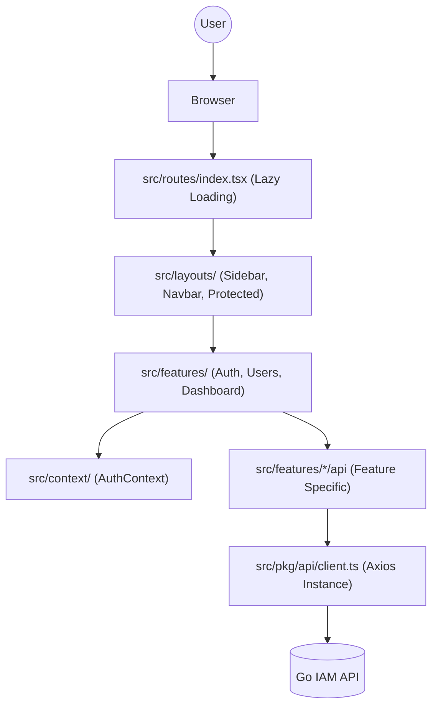

# Frontend Architecture Documentation

This document provides a comprehensive overview of the `ui` codebase for Monkeys Identity, detailing the structure, implementation patterns, and development guidelines.

## 1. Introduction
The Monkeys Identity frontend is a modern, feature-based React application designed for scalability and maintainability. It utilizes a "Screaming Architecture" where the folder structure reflects the domain features of the application rather than just technical types (like "components" or "containers").

## 2. Architecture Overview

### 2.1 Visualization
The following diagram illustrates the relationship between the core layers of the application:

### 2.2 Data Flow
1.  **Request Layer**: Feature-specific API modules (e.g., `src/features/users/api/user.ts`) utilize a centralized Axios client in `src/pkg/api/client.ts`.
2.  **State Layer**: Global state (like authentication) is managed via React Context in `src/context/`. Feature-specific state is kept local to the feature components or custom hooks.
3.  **UI Layer**: Components within features consume data from hooks/contexts and render the UI using Tailwind CSS for styling.

## 3. Technology Stack
- **Framework**: [React 19](https://react.dev/)
- **Build Tool**: [Vite](https://vitejs.dev/)
- **Styling**: [Tailwind CSS 4](https://tailwindcss.com/)
- **Icons**: [Lucide React](https://lucide.dev/)
- **Routing**: [React Router 7](https://reactrouter.com/)
- **HTTP Client**: [Axios](https://axios-http.com/)

## 4. Core Concepts

### 4.1 Feature-Based Structure (Screaming Architecture)
Each major domain area resides in `src/features/`. A typical feature folder includes:
- `api/`: API request functions.
- `components/`: Feature-specific UI components.
- `pages/`: Page-level components associated with routes.
- `types/`: TypeScript definitions for the feature.
- `guards/`: Route guards or authorization logic (if applicable).

### 4.2 Centralized Routing
All routes are defined and lazy-loaded in `src/routes/index.tsx`. This ensures code splitting by feature, improving initial load times.

## 5. Directory Breakdown

### `src/` Directory
| Folder | Description |
| :--- | :--- |
| `features/` | Core domain logic (Auth, Dashboard, Users, Landing). |
| `layouts/` | Structural wrappers like `Sidebar`, `Navbar`, and `ProtectedRouteLayout`. |
| `components/` | Generic UI components used across multiple features (e.g., Buttons, Modals). |
| `context/` | Global state providers (e.g., `AuthContext.tsx`). |
| `routes/` | Application routing configuration. |
| `constants/` | Configuration values and static mappings (e.g., `sidebar.ts`). |
| `utils/` | Shared helper functions and validation logic (e.g., `validateSignupForm.ts`). |
| `pkg/` | Internal shared modules, such as the base API client. |
| `types/` | Global TypeScript interfaces and shared types. |
| `assets/` | Static files like images, fonts, and global CSS. |

## 6. Developer Guide: Reading the Code

If you are new to the codebase, follow this path to understand a feature:
1.  **Entry Point**: Start at `src/routes/index.tsx` to see which feature is mapped to a URL.
2.  **Layout**: Check the layout being used in `App.tsx` (usually `ProtectedRouteLayout` for authenticated pages).
3.  **Feature Page**: Open the corresponding page in `src/features/[feature]/pages/`.
4.  **Logic & Data**: Look at the components inside that page and trace data fetching back to `src/features/[feature]/api/`.

## 7. Development Workflow

### Adding a New Feature
1.  Create a new directory in `src/features/`.
2.  Define your feature's `api`, `types`, and `components`.
3.  Create a page in `src/features/[feature]/pages/`.
4.  Register the page with a lazy load in `src/routes/index.tsx`.
5.  Add the route to the `App.tsx` routing structure.

### Styling Guidelines
- Use Tailwind CSS utility classes exclusively.
- Define custom theme tokens in `tailwind.config.js` if needed (currently using Tailwind 4 configuration patterns).
- Maintain consistent spacing and colors by referencing the existing `index.css` tokens.

## 8. Build and Deployment
The application is Dockerized.
- **Development**: Managed via `docker compose up`.
- **Production**: Run `npm run build` to generate the static assets in the `dist/` folder, which can be served by any static host or Nginx.
